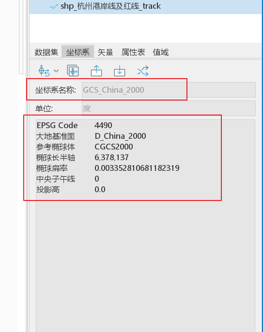
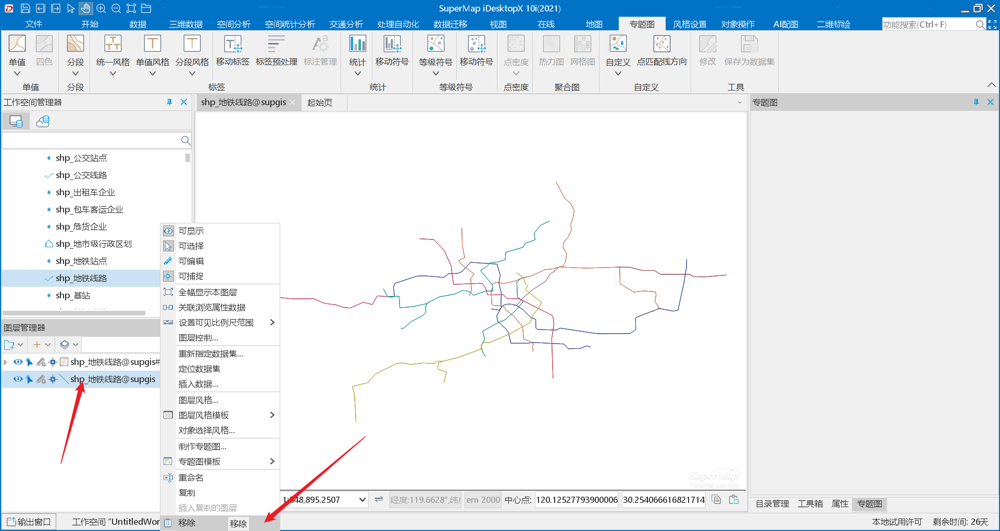

# iServer配置图层服务以及前端使用

* 前端使用

**配置好的图层服务有一个名称，我们通过这个名称去get请求一个json，可以拿到一串数据，这个可以前端去拿，也可以后端拿到返给前端，拿到的数据里面包括数据源的数据，图层的数据，可以直接用，也可以在这个基础上修改样式，需要注意的是这里拿到的切片url如果没有viewBounds={bbox-epsg-3857}会导致拿不到图层元素的系统字段，如smid等（以前没有配置这个参数是可以拿到的，超图更新后就拿不到了）**

以一个图层名为zk_cross_index_test_mvt的案例

1.首先请求/iserver/services/map-mvt-zkcrossindextestmvt/restjsr/v1/vectortile/maps/zk_cross_index_test_mvt/style.json

2.拿到的数据

```
{
  "metadata": {
    "mapcenter": [119.5615, 29.886],
    "indexbounds": [-180, -270, 180, 90],
    "mapscale": 0.000006432916202249,
    "epsgcode": 4490,
    "topscale": 3.38032714320531e-9,
    "mapbounds": [118.4376, 29.2123, 120.6854, 30.5597]
  },
  "sources": {
    "zk_cross_index_test_mvt": {
      "tiles": [
        "http://172.18.91.192:8090/iserver/services/map-mvt-zkcrossindextestmvt/restjsr/v1/vectortile/maps/zk_cross_index_test_mvt/tiles/{z}/{x}/{y}.mvt"
      ],
      "bounds": [-180, -90, 180, 90],
      "type": "vector"
    }
  },
  "center": [119.5615, 29.8859999991976],
  "name": "zk_cross_index_test_mvt",
  "sprite": "http://172.18.91.192:8090/iserver/services/map-mvt-zkcrossindextestmvt/restjsr/v1/vectortile/maps/zk_cross_index_test_mvt/sprites/sprite",
  "layers": [
    {
      "paint": {
        "background-color": "rgba(255,255,255,1.00)"
      },
      "id": "background",
      "type": "background"
    },
    {
      "layout": {
        "visibility": "visible",
        "icon-size": 1,
        "icon-image": "marker_317_4_366092"
      },
      "filter": [
        "all",
        [
          "==",
          "$type",
          "Point"
        ]
      ],
      "metadata": {
        "layer:caption": "zk_cross_index_test_mvt"
      },
      "maxzoom": 21,
      "paint": {

      },
      "id": "zk_cross_index_test_mvt@172.18.94.235:15432_supgis(0_21)",
      "source": "zk_cross_index_test_mvt",
      "source-layer": "zk_cross_index_test_mvt@172.18.94.235:15432_supgis",
      "type": "symbol",
      "minzoom": 0
    }
  ],
  "zoom": 10.9,
  "glyphs": "http://172.18.91.192:8090/iserver/services/map-mvt-zkcrossindextestmvt/restjsr/v1/vectortile/maps/zk_cross_index_test_mvt/fonts/{fontstack}/{range}",
  "version": 8
}
```

3.通过addSource和addLayer来加载图层

* iServer配置图层服务

1.在https://www.supermapol.com/market/timelicense/desktop下载iServer桌面应用(有试用，需要购买的，据我所知目前不支持mac，不是太清楚)

2.启动应用，打开数据源。

</img>

</img>

3.导入图层数据。

</img>

4.点击+号选择需要导入的shp文件(注意:结果数据集如果不是4490坐标系，后续需要转换坐标系，这里命名后续加上坐标系以方便后续转换为4490)

</img>

5.坐标系转换，如果该图层的坐标系为4490可跳过此步骤，进行下一步。

右键该图层属性

</img>

坐标系-坐标转换

</img>

选择要转换的坐标系，使用2000投影坐标系

</img>

6.制作图层。

找到该图层右击属性判断一下坐标系是否正确

</img>

下方为正确的坐标系，如果不一样需切换坐标系

</img>

切换坐标系

</img>

双击该数据源打开图层

</img>

判断经纬度及中心点坐标是否正常，如果不正常则有可能是数据实际坐标系不正确或者数据里某条数据经纬度不正确

</img>

右键图层风格开始制作样式(注意：点不能使用默认图标，会导致图层不能展示。)

</img>

</img>

保存图层(修改图层标题，跟数据源名称保持一致。)

</img>

</img>

点击左上角保存按钮，注意名称保持一致

</img>

点击保存，选择要保存的位置，名字与图层标题保持一致，点击确定

</img>

7.发布图层。

找到刚保存的图层文件，压缩为zip

</img>

去发布

</img>

</img>

点击远程浏览，上传做好的图层文件

</img>

切换到supMapDatas目录下。点击上传数据

</img>

</img>

找到上传的目录

</img>

点进去选择smwu文件

</img>

进入下一步，选择地图服务与数据服务,进入下一步

</img>

勾选：选择发布数据集，并去掉全选，只选择该图层对应的数据源，进入下一步

</img>

下一步，点击完成

</img>

发布完成后点击服务修改图层名称。（图层会将中文自动转为拼音，如shp_HangZhouGangAnXianJiHongXian_track）

</img>

8.更新图层服务

* 专题图制作

一、单值专题图

1.打开图层

</img>

2.点击专题图

</img>

3.此设置可使图层放大到该比例尺在显示文字。可根据需求设置

</img>

4.保存图层，保存前注意修改图层名称

</img>

</img>

二、分段专题图

1.打开图层后，点击专题图-单值

</img>

2.生成新图层后将原图层删除

</img>

3.修改图层名称

</img>

4.点击专题图，设置对应的字段，点击风格可设置颜色线条

</img>

5.加载模板

</img>

</img>

6.保存模板

</img>