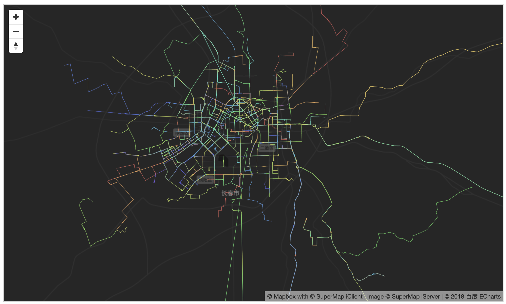

# 数据可视化

SuperMap iClient for MapboxGL 支持可视化包含：

1.热力图

2.高效率点图层

3.ECharts

4.EChartsGL

5.DeckGL

6.MapV

7.Threejs

* 热力图

**应用场景：由于热力图的衰减是像素级别的，视觉效果方面极佳，但不能与具体数据进行一一对应，只能表示权重之间的差别，所以可以用于一些对精度要求不高而需要重点突出权重渐变的行业，如可以制作气象温度对比动态效果图、地震区域的震点强弱图等。**

示例代码：

```
// 定义热力点数量，加热力半径
heatMapLayer = new mapboxgl.supermap.HeatMapLayer(
    "heatMap",
    {
        "map": map,
        "id": "heatmap",
        "radius": 45,
        //featureWeight指定以哪个属性值为热力权重值创建热力图
        "featureWeight": "value",
    }
);

// 构造热力中心点
function createHeatPoints() {
    clearHeatPoints();
    let heatPoints = [];
    let num = 200;
    let radius = 50;
    let unit = "px";
    heatMapLayer.useGeoUnit = true;
    heatMapLayer.radius = radius;

    let features = [];
    for (let i = 0; i < num; i++) {
        features[i] =
        {
            "type": "feature",
            "geometry": {
                "type": "Point",
                "coordinates": [
                    Math.random() * 360 - 180,
                    Math.random() * 160 - 80]
            },
            "properties": {
                "value": Math.random() * 9,
            }
        };
    }

    let heatPoints = {
        "type": "FeatureCollection",
        "features": features
    };

    heatMapLayer.addFeatures(heatPoints);
    map.addLayer(heatMapLayer);
}
```

运行效果如下：

</img>

* 高效率点图层

**高效率点图层（graphicLayer），主要是针对前端大数据量的点渲染。graphicLayer 支持选取对象事件。(需要引入PapaParse,deck.gl,dat-gui)**

```
$.get('../data/nyc-taxi.csv', function (csvstr) {
    // 读取文件中的数据
    let result = Papa.parse(csvstr, {skipEmptyLines: true, header: true});
    addLayer(result.data);
});
// 定义样式相关属性
function addLayer(points) {
    let graphics = [];
    for (let i = 0; i < points.length; i++) {

        let lngLat = {
            lng: parseFloat(points[i].lng),
            lat: parseFloat(points[i].lat)
        };
        /**
         * 可以单独给要素设置颜色和半径:
         * new mapboxgl.supermap.Graphic(lngLat,{
         *      color:[255,0,0],
         *      radius:40
         * });
         */
        graphics.push(new mapboxgl.supermap.Graphic(lngLat));
    }

    let graphicStyle = {
        color: [0, 255, 128],
        radius: 10
    };
    // 绘制对象，并添加到图层上
    graphicLayer = new mapboxgl.supermap.GraphicLayer("graphic", {
        graphics: graphics,
        radius: graphicStyle.radius,
        color: graphicStyle.color,
        highlightColor: [255, 0, 0, 255],
    });
    // 将画出来的点渲染到地图上
    map.addLayer(graphicLayer);
}
```

运行效果如下：

</img>

* ECharts

**ECharts 提供了常规的折线图、柱状图、散点图、饼图、K线图，用于统计的盒形图，用于地理数据可视化的地图、热力图、线图，用于关系数据可视化的关系图、treemap、旭日图，多维数据可视化的平行坐标，还有用于 BI 的漏斗图，仪表盘，并且支持图与图之间的混搭。(需要引入ECharts,echartsLayer)**

下面以长春市公交路特效图为例，将公交路线的数据进行可视化的展示：

```
let uploadedDataURL = "../data/changchunBus.json";
$.get(uploadedDataURL, function (data) {
    option = {
        animation: false,
        GLMap: {
            roam: true
        },
        coordinateSystem: 'GLMap',
        geo: {
            map: 'GLMap',
        },

        series: [{
            type: 'lines',
            polyline: true,
            data: data,
            silent: true,
            lineStyle: {
                normal: {
                    opacity: 0.2,
                    width: 1
                }
            },
            progressiveThreshold: 500,
            progressive: 100,
        }, {

            type: 'lines',
            coordinateSystem: 'GLMap',
            polyline: true,
            data: data,
            lineStyle: {
                normal: {
                    width: 0.2
                }
            },
            effect: {
                constantSpeed: 40,
                show: true,
                trailLength: 0.02,
                symbolSize: 2
            },
        }]
    };
    let echartslayer = new EchartsLayer(map);
    echartslayer.chart.setOption(option);
});
```

运行效果如下：

</img>

* EChartsGL

**ECharts GL 是 ECharts 的 WebGL 扩展，其中提供了三维散点图，飞线图，柱状图，曲面图，地球等多种三维可视化方式。并且增加 scatterGL，graphGL 系列类型用于二维的散点图，关系图的加速绘制和布局。(需要引入ECharts,echartsLayer,ECharts-GL)**

下面以全球风能为例，将风能数据进行可视化的展示：

```
map.on('load', function () {
    $.getJSON('../data/globalWindData.json', function (windData) {
    let data = [];
    let p = 0;
    let maxMag = 0;
    let minMag = Infinity;
    for (let j = 0; j < windData.ny; j++) {
        for (let i = 0; i < windData.nx; i++, p++) {
            let vx = windData.data[p][0];
            let vy = windData.data[p][1];
            let mag = Math.sqrt(vx * vx + vy * vy);
            // 数据是一个一维数组
            // [ [经度, 纬度，向量经度方向的值，向量纬度方向的值] ]
            data.push([
                i / windData.nx * 360 - 180,
                j / windData.ny * 180 - 90,
                vx,
                vy,
                mag
            ]);
            maxMag = Math.max(mag, maxMag);
            minMag = Math.min(mag, minMag);
        }
    }

    let echartslayer = new EchartsLayer(map);
    echartslayer.chart.setOption({
        GLMap: {
            roam: true,
        },
        geo: {
            map: "GLMap"
        },
        visualMap: {
            left: 'right',
            min: minMag,
            max: maxMag,
            dimension: 4,
            inRange: {
                color: ['#313695', '#4575b4', '#74add1', '#abd9e9', '#e0f3f8', '#ffffbf', '#fee090', '#fdae61', '#f46d43', '#d73027', '#a50026']
            },
            realtime: false,
            calculable: true,
            textStyle: {
                color: '#fff'
            }
        },
        series: [{
            type: 'flowGL',
            coordinateSystem: 'GLMap',
            data: data,
            particleDensity: 512,
            particleSpeed: 2,
            particleSize: 1,
            gridWidth: windData.nx,
            gridHeight: windData.ny,
            itemStyle: {
                opacity: 0.7
            }
         }]
     });
    });
});
```

运行效果如下：

</img>

* DeckGL

**DeckGL 是由 Uber 开发并开源出来的基于 WebGL 的大数据量可视化框架。它具有提供不同类型可视化图层，GPU渲染的高性能，React 和 Mapbox GL 集成，结合地理信息数据（GPS）的特点。(需要引入deck.gl)**

对数据进行蜂巢图层展示:

```
$.get('../data/deck.gl/sf-bike-parking.json', function (features) {
    addLayer(features);
});
function addLayer(features) {
    deckglLayer = new mapboxgl.supermap.DeckglLayer("hexagon-layer", {
        data: features,
        props: {
             extruded: true, // 是否拉伸要素，默认为false
             radius: 200, // 六边形半径值，默认为1000
             elevationScale: 4, // 高程乘数
             coverage: 0.8 // 六边形半径乘数，介于0 - 1之间。六边形的最终半径通过覆盖半径计算。
            // 还可配置的参数：
            // colorRange 色带，
            // 默认为 [[255,255,178,255],[254,217,118,255],[254,178,76,255],[253,141,60,255],[240,59,32,255],[189,0,38,255]]
        },
        callback: {
            getPosition: d => d.COORDINATES,
        }
    });
    map.addLayer(deckglLayer);
}
```

运行效果如下：

</img>

* MapV

**MapV 是一款地理信息可视化开源库，可以用来展示大量地理信息数据，点、线、面的数据，每种数据也有不同的展示类型，如直接打点、热力图、网格、聚合等方式展示数据。MapV 可展示大量的点数据，形式可以为热力图、网格、蜂窝状、点聚合、按颜色区间、按半径大小等。可展示大量的线数据，如普通画线、高亮叠加、热力线数据展示等方式，还有各种动画效果，适合用于呈现大量轨迹的场景。也可展示大量的自定义面数据，按颜色区间来展示，行政区域也是其中一种应用场景，可直接使用。(需要引入MapV)**

SuperMap iClient for MapboxGL 提供了对使用 MapV 可视化效果图层的支持，接口为:mapboxgl.supermap.MapvLayer(dataSet, options)

下面以 MapV 强边界图为例，将数据进行可视化的展示:

```
let randomCount = 500;
let node_data = {
    "0": {"x": 108.154518, "y": 36.643346},
    "1": {"x": 121.485124, "y": 31.235317},
};
let edge_data = [
    {"source": "1", "target": "0"}
];
let citys = ["北京", "天津", "上海", "重庆", "石家庄", "太原", "呼和浩特", "哈尔滨", "长春", "沈阳", "济南", "南京", "合肥", "杭州", "南昌", "福州", "郑州", "武汉", "长沙", "广州", "南宁", "西安", "银川", "兰州", "西宁", "乌鲁木齐", "成都", "贵阳", "昆明", "拉萨", "海口"];

// 构造数据
for (let i = 1; i < randomCount; i++) {
    let cityCenter = mapv.utilCityCenter.getCenterByCityName(citys[parseInt(Math.random() * citys.length)]);
    node_data[i] = {
        x: cityCenter.lng - 5 + Math.random() * 10,
        y: cityCenter.lat - 5 + Math.random() * 10,
    };
    edge_data.push(
        {"source": ~~(i * Math.random()), "target": '0'}
    );
}

let fbundling = mapv.utilForceEdgeBundling()
    .nodes(node_data)
    .edges(edge_data);

let results = fbundling();

let data = [];
let timeData = [];

for (let i = 0; i < results.length; i++) {
    let line = results[i];
    let coordinates = [];
    for (let j = 0; j < line.length; j++) {
        coordinates.push([line[j].x, line[j].y]);
        timeData.push({
            geometry: {
                type: 'Point',
                coordinates: [line[j].x, line[j].y]
            },
            count: 1,
            time: j
        });
    }

    data.push({
        geometry: {
            type: 'LineString',
            coordinates: transformCoords(coordinates)
        }
    });

    function transformCoords(coordinates) {
        let coords = [];
        coordinates.map(function (coordinate) {
            coords.push(coordinate);
        });
        return coords;
    }
}

let dataSet = new mapv.DataSet(data);

let options = {
    strokeStyle: 'rgba(55, 50, 250, 0.3)',
    globalCompositeOperation: 'lighter',
    shadowColor: 'rgba(55, 50, 250, 0.5)',
    shadowBlur: 10,
    lineWidth: 1.0,
    draw: 'simple'
};

// mapboxgl.supermap.MapvLayer 构造函数的第一个 map 参数将在下个版本遗弃
let mapVLinelayer = new mapboxgl.supermap.MapvLayer("", dataSet, options);
map.addLayer(mapVLinelayer);

// 创建MapV图层
let dataSet = new mapv.DataSet(timeData);

let options = {
    fillStyle: 'rgba(255, 250, 250, 0.9)',
    globalCompositeOperation: 'lighter',
    size: 1.5,
    animation: {
        type: 'time',
        stepsRange: {
            start: 0,
            end: 100
        },
        trails: 1,
        duration: 5
    },
    draw: 'simple'
};

// mapboxgl.supermap.MapvLayer 构造函数的第一个 map 参数将在下个版本遗弃
let mapVAnimationLinelayer = new mapboxgl.supermap.MapvLayer("", dataSet, options);
map.addLayer(mapVAnimationLinelayer);
```

运行效果如下：

</img>

* Threejs

**Three.js 是一款开源的主流 3D 绘图 JS 引擎(需要引入Three.js,GLTFLoader)**

SuperMap iClient for MapboxGL 提供了对使用 Three.js 可视化效果图层的支持，接口为:mapboxgl.supermap.ThreeLayer('three')

```
function loaderModels() {
    let loader = new THREE.GLTFLoader();
    // 加载gltf格式数据
    loader.load('./js/airplane/airplane.glb', function (gltf) {
        let scene = gltf.scene;
        scene.rotation.x = -Math.PI / 2;
        scene.rotation.y = Math.PI / 2;
        scene.scale.multiplyScalar(150);

        addThreeLayer(scene);
    });
}

function addThreeLayer(meshes) {
    threeLayer = new mapboxgl.supermap.ThreeLayer('three');
    threeLayer.on("initialized", render);
    threeLayer.addTo(map);

    function render() {
        let renderer = threeLayer.getThreeRenderer(),
            scene = threeLayer.getScene(),
            camera = threeLayer.getCamera();

        this.light = new THREE.PointLight(0xaaaaaa, 0.5);
        this.light.position.copy(camera.position);
        scene.add(this.light);
        scene.add(new THREE.AmbientLight(0xffffff));
        threeLayer.setPosition(meshes, position);
        // 设置飞行高度
        meshes.translateY(5000);
        scene.add(meshes);

        (function animate() {
            requestAnimationFrame(animate);
            meshes.position.y -= 60;
            let center = map.getCenter().toArray();
            center[1] += 0.00008;
            map.setCenter(center);
            renderer.render(scene, camera);
        })()
    }

    // 均匀光照，与相机位置同步
    threeLayer.on("render", function () {
        threeLayer.light.position.copy(threeLayer.renderer.camera.position);
    });
}
```

运行效果如下：

</img>