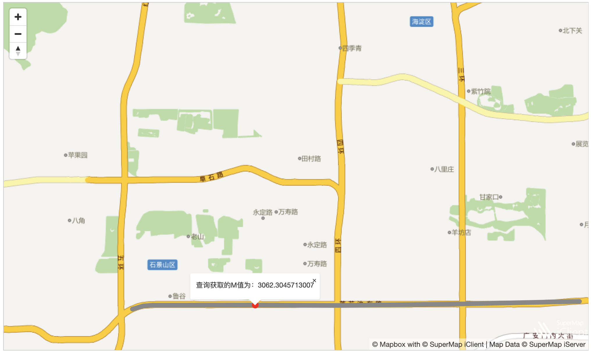
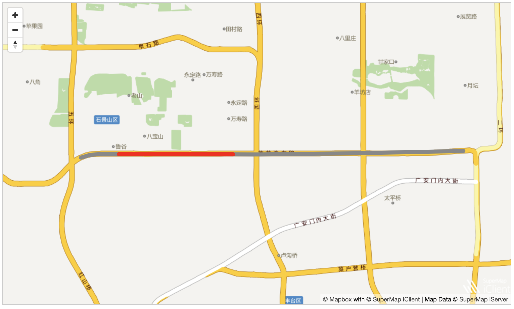
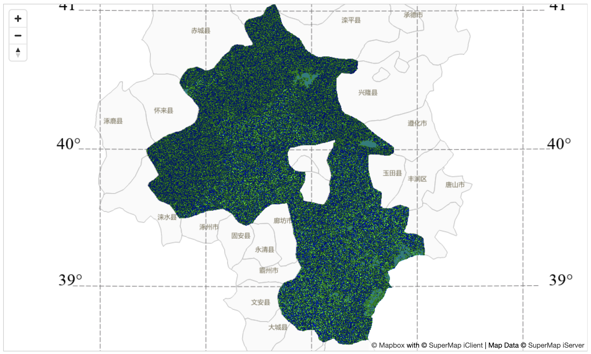

# 空间分析

* 缓冲区分析

**缓冲区分析（buffer）是根据指定的距离在点、线和多边形实体周围自动建立一定宽度的区域范围的分析方法。例如，在环境治理时，常在污染的河流周围划出一定宽度的范围表示受到污染的区域；又如在飞机场，常根据附近居民的健康需要在周围划分出一定范围的区域作为非居住区等。下面以京津数据为例，对“莲花池东路”进行半径为 300 米的圆头缓冲分析，缓冲区分析的接口使用方法如下：**

```
//设置缓冲区分析参数
let dsBufferAnalystParams = new mapboxgl.supermap.DatasetBufferAnalystParameters({
    // 用来做缓冲区分析的数据源中数据集名称
    dataset: "Road_L@Jingjin",
    // 设置数据集中集合对象的过滤条件
    filterQueryParameter: new mapboxgl.supermap.FilterParameter({
        // 属性过滤条件
        attributeFilter: "NAME='莲花池东路'"
    }),
    //缓冲区分析通用参数设置
    bufferSetting: new mapboxgl.supermap.BufferSetting({
        // 缓冲区端点枚举值，包含FLAT和ROUND
        endType: mapboxgl.supermap.BufferEndType.ROUND,
        // 左侧缓冲距离
        leftDistance: {value: 300},
        // 右侧缓冲距离
        rightDistance: {value: 300},
        // 圆头缓冲圆弧处线段的个数
        semicircleLineSegment: 10,
        radiusUnit:'METER'
    })
});

// 设置缓冲区分析服务对象，用于将客户端设置的缓冲区分析服务参数传递给服务端，并接收服务端返回的缓冲区分析结果数据。当向服务端发送请求并且服务端成功返回结果时，用户可对获得的缓冲区分析结果做相应处理。
let serviceUrl = "https://iserver.supermap.io/iserver/services/spatialanalyst-sample/restjsr/spatialanalys"
// 创建缓冲区分析服务
let bufferServiceByDatasets =new mapboxgl.supermap.SpatialAnalystService(serviceUrl);
// 向服务端发送服务请求，并获取返回的结果
bufferServiceByDatasets.bufferAnalysis(dsBufferAnalystParams).then(function(serviceResult){
    // 获取服务端返回的数据
    let result = serviceResult.result;
});
```

运行效果如下：

</img>

* 泰森多边形

**泰森多边形是荷兰气候学家 A.H.Thiessen 提出的一种根据离散分布的气象站的降雨量来计算平均降雨量的方法，即将所有相邻气象站连成三角形，作这些三角形各边的垂直平分线，于是每个气象站周围的若干垂直平分线便围成一个多边形。用这个多边形内所包含的一个唯一气象站的降雨强度来表示这个多边形区域内的降雨强度，并称这个多边形为泰森多边形。泰森多边形又称为 Voronoi 图，是由一组连接两邻点直线的垂直平分线组成的连续多边形组成。泰森多边形的特性为每个泰森多边形内仅含有一个离散点数据，泰森多边形内的点到相应离散点的距离最近，位于泰森多边形边上的点到其两边的离散点的距离相等。**

```
let serviceUrl = "https://iserver.supermap.io/iserver/services/spatialanalyst-sample/restjsr/spatialanalyst";
// 设置泰森多边形分析参数
let dsThiessenAnalystParameters = new mapboxgl.supermap.DatasetThiessenAnalystParameters({
    dataset: "Town_P@Jingjin"
});
// 创建泰森多边形分析实例
new mapboxgl.supermap.SpatialAnalystService(serviceUrl).thiessenAnalysis(dsThiessenAnalystParameters).then(function (serviceResult) {
    // 获取返回的features数据
    let features = serviceResult.result.regions;
});
```

运行效果如下：

</img>

* 叠加分析

**叠加分析是 GIS 中的一项非常重要的空间分析功能，是指在统一空间参考系统下，通过对两个数据集进行的一系列集合运算，产生新数据集的过程，其目的是通过对空间数据的加工或分析，提取用户需要的新的空间几何信息。同时，通过叠加分析，还将对数据的各种属性信息进行处理。**

目前叠加分析广泛应用于资源管理、城市建设评估、国土管理、农林牧业、统计等领域。叠加分析在各领域中的作用：

1.资源管理主要应用于农业和林业领域，解决农业和林业领域各种资源（如土地、森林、草场等）分布变化、统计等问题；

2.城市建设评估主要应用于分析城市人口、经济、建设等的发展变化，统计变化趋势和变化规律；

3.土地和地籍管理涉及土地使用性质变化、地块轮廓变化、地籍权属关系变化等许多内容，借助 GIS 的叠加分析功能可以高效、高质量地完成这些工作；

4.生态、环境的管理评价用于区域生态规划的评价、环境现状评价、环境影响评价、污染物削减分配的决策支持等；

5.地学研究与应用中的地形分析、流域分析、土地利用研究、经济地理研究、空间统计分析、制图等都可以借助叠加分析来完成。

下面将京津地区的行政区域与临边地区的行政区域进行叠加分析，叠加分析接口使用方法如下所示：

```
// 设置叠加分析参数
let dsOverlayAnalyParams = new mapboxgl.supermap.DatasetOverlayAnalystParameters({
    // 叠加分析中源数据集的名称
    sourceDataset: "BaseMap_R@Jingjin",
    // 叠加分析中操作数据集名称
    operateDataset: "Neighbor_R@Jingjin",
    // 容限
    tolerance: 0,
    // 叠加分析操作类型
    operation: mapboxgl.supermap.OverlayOperationType.UNION
});

let serviceUrl = "https://iserver.supermap.io/iserver/services/spatialanalyst-sample/restjsr/spatialanalyst";
// 创建叠加分析服务实例
let overlayAnalystService =new mapboxgl.supermap.SpatialAnalystService(serviceUrl);
// 向服务端发送服务请求，并获取返回的结果
overlayAnalystService.overlayAnalysis(dsOverlayAnalyParams).then(function (serviceResult) {
    // 获取返回的features数据
    let features = serviceResult.result.regions;
});
```

运行效果如下：

</img>

* 提取等值线/面

**提取等值线和提取等值面。等值线是将相邻的、具有相同值的点连起来的线，常用的等值线有等高线、等深线、等温线、等压线、等降水量线等。等值线的分布反映了栅格表面上值的变化，等值线分布越密集的地方，表示栅格表面值的变化比较剧烈。等值线分布较稀疏的地方，表示栅格表面值的变化较小。通过提取等值线，可以找到高程、温度、降水量等值相同的位置，同时等值线的分布状况也可以反映出变化的陡峭和平缓区。等值面是由相邻的等值线封闭组成的面，等值面的变化可以很直观地表示出相邻等值线之间的变化，诸如高程、降水、温度或大气压力等。通过提取等值面可以获得高程、降水、温度等值相同的地方。**

下面从全国平均气温采样点中提取等值线的功能来具体说明表面分析的接口使用:

```
// 剪裁区域设置
let region = {
    "type": "Feature",
    "geometry": {
        "type": "Polygon",
        "coordinates": [[
            [0, 4010338],
            [1063524, 4010338],
            [1063524, 3150322],
            [0, 3150322]
        ]]
    }
};
// 表面分析参数设置
let extractParams = new mapboxgl.supermap.SurfaceAnalystParametersSetting({
    datumValue: 0, // 表面分析中提取等值线基准值
    interval: 2, // 等值距，两条等值线之间的间隔值
    resampleTolerance: 0, // 重采样容限
    smoothMethod: mapboxgl.supermap.SmoothMethod.BSPLINE, // 光滑处理所使用的方法
    smoothness: 3, // 等值线的光滑度
    clipRegion: region // 裁剪对象
});
// 表面分析提取操作参数
let surfaceAnalystParams = new mapboxgl.supermap.DatasetSurfaceAnalystParameters({
    extractParameter: extractParams, // 表面分析参数
    dataset: "SamplesP@Interpolation", // 叠加分析中源数据集名称
    resolution: 3000, // 中间结果分辨率
    zValueFieldName: "AVG_TMP" // 用于提取操作的字段名称
});

let serviceUrl = "https://iserver.supermap.io/iserver/services/spatialanalyst-sample/restjsr/spatialanalyst" ;
// 创建表面分析服务实例
let surfaceAnalystService =new mapboxgl.supermap.SpatialAnalystService(serviceUrl);
// 向服务端发送请求，并对返回的结果进行处理
surfaceAnalystService.surfaceAnalysis(surfaceAnalystParams).then(function (serviceResult) {
    // 获取返回的features数据
    let features = serviceResult.result.regions;
});
```

运行效果如下：

</img>

* 点定里程

**点定里程是计算路由上某点到起始点的 M 值，实际应用情景例如知道某事故发生的位置确定该点位于某路口距离。**

下面以京津数据为例，计算一条路上发生交通事故的地点到该条路路口的距离，点定里程接口使用方法如下：

```
// 为了构造下面点定里程服务sourceRoute属性的routeLine
let piontLists = [
    [116.2143386597, 39.8959419733, 0],
    [116.217501999125, 39.896670999665, 282.3879789906],
    [116.220156000875, 39.896820999605, 509.9746364534],
    [116.228716999, 39.8968419995966, 1242.1340098965],
    [116.25000000025, 39.8968619995886, 3062.3045713007],
    [116.27412300025, 39.8967689996258, 5125.3836697258],
    [116.310443000875, 39.8971139994878, 8231.7823666408],
    [116.344168500812, 39.8976724992644, 11116.7053546891]
];

let LineGeometryData = {
    "type": "Feature",
    "geometry": {
        "type": "LineString",
        "coordinates": piontLists
    }
};

// 将形成路由的点提出来，为了构造下面点定里程服务sourceRoute
let routeObj = LineGeometryData.geometry.coordinates;
let routeLine = LineGeometryData;

// 在组成路由的点中选取一个查询点(数组中第4个点)，并添加到地图上
let point = [routeObj[4][0], routeObj[4][1]];
let pointGeometryData = {
    "type": "Feature",
    "geometry": {
        "type": "Point",
        "coordinates": point
    }
};
// 创建点定里程服务实例
let serviceUrl ="https://iserver.supermap.io/iserver/services/spatialanalyst-sample/restjsr/spatialanalyst";
let routeCalculateMeasureService =new mapboxgl.supermap.SpatialAnalystService(serviceUrl);
// 点定里程服务参数设置
let routeCalculateMeasureParameters = new mapboxgl.supermap.RouteCalculateMeasureParameters({
    "sourceRoute": routeLine, // 路由类型
    "point": pointGeometryData,// 查询点
    "tolerance": 0.0001,
    "isIgnoreGap": false
});
// 向服务端发送请求并获取数据
routeCalculateMeasureService.routeCalculateMeasure(routeCalculateMeasureParameters).then(function (routeCaculateServiceResult) {
    // 获取服务端返回的数据
    let result = routeCaculateServiceResult.result；
});
```

运行效果如下：

</img>

* 里程定点

**里程定点是根据指定路由上的 M 值来定位点。应用情景与点定里程相反，如知道某事故距离某路口位置，需要确定其相对精确的坐标的时候使用。**

下面以京津数据为例，确定一条发生交通事故的路上与路口距离为 6753 m 的事故点，里程定点的接口使用方法：

```
// 为了构造下面里程定点服务sourceRoute属性的routeLine
let piontLists = [
    [116.2143386597, 39.8959419733, 0],
    [116.217501999125, 39.896670999665, 282.3879789906],
    [116.220156000875, 39.896820999605, 511.787745072744],
    [116.228716999, 39.8968419995966, 1253.201708792909],
    [116.25000000025, 39.8968619995886, 3103.167523778722],
    [116.27412300025, 39.8967689996258, 5201.062444476062],
    [116.310443000875, 39.8971139994878, 8360.617856315024],
    [116.344168500812, 39.8976724992644, 11294.738396325054]
    ];

 let LineGeometryData = {
    "type": "Feature",
    "geometry": {
        "type": "LineString",
        "coordinates": piontLists
         }
};
// 将形成路由的点提出来，为了构造下面点定里程服务sourceRoute
let routeLine = LineGeometryData;

// 创建里程定点服务实例
let serviceUrl ="https://iserver.supermap.io/iserver/services/spatialanalyst-sample/restjsr/spatialanalyst";
let routeLocatorService =new mapboxgl.supermap.SpatialAnalystService(serviceUrl);
// 里程定点参数设置
let routeLocatorParams_point = new mapboxgl.supermap.RouteLocatorParameters({
    "sourceRoute": routeLine, // 路由对象
    "type": "POINT", // 类型，点或线
    "measure": 6753, // 里程值
    "offset": 0, // 定位点偏移量
    "isIgnoreGap": true // 是否忽略子对象之间的距离
    });
// 向服务器发送请求进行里程定点服务分析，并将返回的结果进行处理展现在客户端上
routeLocatorService.routeLocate(routeLocatorParams_point).then(function (serviceResult) {
    // 获取服务端返回的数据
    let result = routeCaculateServiceResult.result；
});
```

运行效果如下：

</img>

* 里程定线

**里程定线是根据指定线的范围来确定路由上对应的线对象。应用场景如当知道某一路段发生阻塞，能够确定该路段相对精确的位置范围。**

下面以京津数据为例，一条路在距离路口 1123-4489 m 之间的发生堵塞：

```
// 为了构造下面里程定线服务sourceRoute属性的routeLine
 let piontLists = [
 [116.2143386597, 39.8959419733, 0],
 [116.217501999125, 39.896670999665, 282.3879789906],
 [116.220156000875, 39.896820999605, 511.787745072744],
 [116.228716999, 39.8968419995966, 1253.201708792909],
 [116.25000000025, 39.8968619995886, 3103.167523778722],
 [116.27412300025, 39.8967689996258, 5201.062444476062],
 [116.310443000875, 39.8971139994878, 8360.617856315024],
 [116.344168500812, 39.8976724992644, 11294.738396325054]
];

let LineGeometryData = {
    "type": "Feature",
    "geometry": {
        "type": "LineString",
        "coordinates": piontLists
    }
};

// 将形成路由的点提出来，为了构造下面点定里程服务sourceRoute
let routeLine = LineGeometryData;
// 里程定线参数设置
let routeLocatorParams_line = new mapboxgl.supermap.RouteLocatorParameters({
   "sourceRoute": routeLine, // 路由对象
   "type": "LINE", // 类型，点或线
   "startMeasure": 1123, // 定位线的起始M值
   "endMeasure": 4489, // 定位线的终止M值
   "isIgnoreGap": true // 是否忽略子对象之间的距离
});
// 创建里程定线服务实例
let serviceUrl ="https://iserver.supermap.io/iserver/services/spatialanalyst-sample/restjsr/spatialanalyst";
let routeLocatorService =new mapboxgl.supermap.SpatialAnalystService(serviceUrl);
// 向服务器发送请求进行里程定线服务分析，并将返回的结果进行处理展现在客户端上
routeLocatorService.routeLocate(routeLocatorParams_line).then(function (serviceResult) {
    // 获取服务端返回的数据
    let result = routeCaculateServiceResult.result；
});
```

运行效果如下：

</img>

* 栅格代数运算

**栅格代数运算是运用代数学的观点对地理特征和现象进行空间分析，即对一个或多个栅格数据进行数学运算和函数运算。同时，运算得出的结果栅格数据的像元值是由一个或多个输入栅格数据的同一位置的像元值通过代数运算得到的。为了更好地实现栅格代数运算功能，SuperMap 提供了丰富的运算符、函数和运算表达式，除了常用的算术运算（如加、减、乘、除和取整等）方法，还支持通过用户自定义的表达式，来进行栅格的算术运算、条件运算、逻辑运算、函数运算（包括常用函数、三角函数等）和复合运算，用户可以通过栅格代数运算实现多种栅格分析需求。**

栅格代数运算接口使用方法如下：

```
// 创建栅格代数运算服务实例
let mathExpressionAnalysisService =new mapboxgl.supermap.SpatialAnalystService(serviceUrl);
// 创建栅格代数运算参数实例
let mathExpressionAnalysisParameters = new mapboxgl.supermap.MathExpressionAnalysisParameters({
    // 指定数据集，必设
    dataset: "JingjinTerrain@Jingjin",
    // 要执行的栅格运算代数表达式，必设
    expression: "[Jingjin.JingjinTerrain] + 600",
    // 存储结果数据集的数据源，必设
    targetDatasource: "Jingjin",
    // 结果数据集名称，必设
    resultGridName: "MathExpressionAnalysis_Result",
    deleteExistResultDataset: true
});
// 向iServer发起栅格代数运算请求
mathExpressionAnalysisService.mathExpressionAnalysis(mathExpressionAnalysisParameters).then(function (serviceResult) {
    // 获取服务端返回的数据
    let mathExpressionAnalysisResult = serviceResult.result;
});
```

运行效果如下：

</img>

* 地形计算

**地形计算又称地形曲率计算，栅格数据表面的曲率，包括平均曲率、剖面曲率和平面曲率。曲率是表面的二阶导数，或者可称之为坡度的坡度。输出结果为地形栅格每个像元的表面曲率，该值通过将该像元与八个相邻像元拟合而得。结果输出为栅格数据集，可输出曲率类型为：平均曲率、剖面曲率和平面曲率，平均曲率为必须输出的结果，剖面曲率和平面曲率为可选择输出。其中，剖面曲率是指沿最大斜率方向的曲率，平面曲率是指垂直于最大斜率方向的曲率。**

设置曲率计算的栅格数据集有以下几个：

1.数据源：列出了当前工作空间中所有的数据源，选择要进行曲率计算的栅格数据集所在的数据源；

2.数据集：列出了当前数据源中所有的栅格数据集，在列表中选择曲率计算栅格数据集。若在工作空间管理器中选中了栅格数据集，则会自动定位到该数据集；

3.高程缩放系数：计算曲率时，要求地形栅格值（即高程值）的单位与 x，y 坐标的单位相同，通常需要将高程值乘以一个高程缩放系数，使得三者单位一致。例如，X、Y 方向上的单位是米，而 Z 方向的单位是英尺，由于 1 英尺等于 0.3048 米，则需要指定缩放系数为 0.3048。如果设置为 1，表示不缩放。

```
// 设置地形曲率计算服务参数
let terrainCurvatureCalculationParameters = new mapboxgl.supermap.TerrainCurvatureCalculationParameters({
    dataset: "JingjinTerrain@Jingjin",
    zFactor: 1.0,
    averageCurvatureName: "CurvatureA",
    deleteExistResultDataset: true
});
// 创建地形曲率计算服务实例
let terrainCurvatureCalculationService =new mapboxgl.supermap.SpatialAnalystService(serviceUrl);
// 向iServer发起地形曲率计算请求
let terrainCurvatureCalculationService.terrainCurvatureCalculate(terrainCurvatureCalculationParameters).then(function (serviceResult) {
    // 获取服务端返回的数据
    let terrainCurvatureCalculationResult = serviceResult.result;
});
```

运行效果如下：

</img>

###### 另外还有交通换乘分析，网络分析，地址匹配，大数据分析等，可以根据需求去实际应用，官网有详细介绍，方法跟空间分析类似，都是先确定参数，再发起服务请求。
