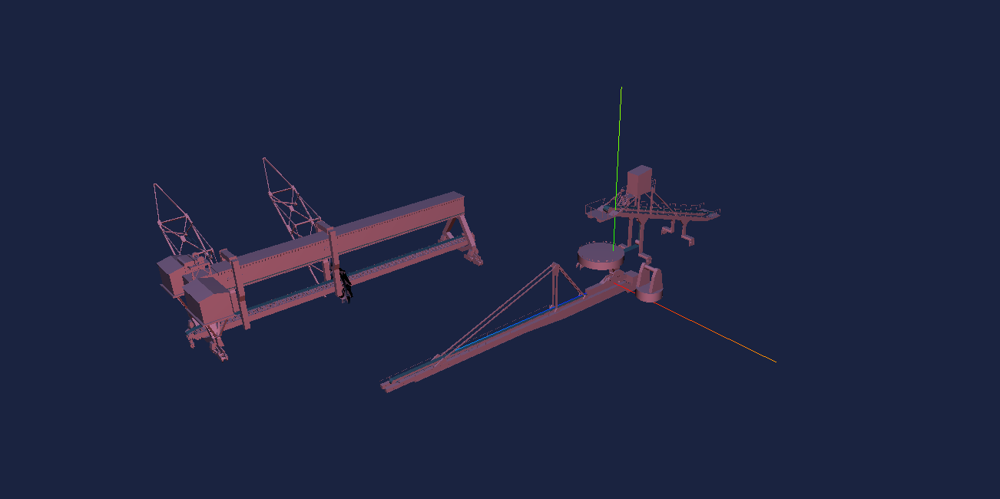

<!--
 * @Autor: 卢建
 * @LastEditors: 卢建
 * @Description: vue结合three.js载入多个obj模型交互场景
 * @Date: 2021-12-03 14:41:50
 * @LastEditTime: 2021-12-03 15:16:45
-->
# vue结合three.js载入多个obj模型交互场景

**应用场景是实现多个三维obj模型导入，进行拼凑，去实现模型的交互，点击，运动等**

* 安装依赖

```
npm i three three-css2drender three-obj-mtl-loader three-orbit-controls -S
```

* demo

```
<!--
 * @Autor: 卢建
 * @LastEditors: 卢建
 * @Description: 三维模型
 * @Date: 2021-12-02 13:07:09
 * @LastEditTime: 2021-12-03 14:59:10
-->
<template>
  <div class="obj" @click="mouseClick"></div>
</template>
<script>
import * as THREE from "three";
import { OBJLoader, MTLLoader } from "three-obj-mtl-loader";
// import { CSS2DRenderer, CSS2DObject } from "three-css2drender";

const OrbitControls = require("three-orbit-controls")(THREE);
export default {
  name: "obj",

  data() {
    return {
      scene: "",
      light: "",
      camera: "",
      controls: "",
      renderer: "",
      allObj: [
        {
          mtl: "http://lvhua.cosys.com.cn/uploads/tj.mtl",
          object: "http://lvhua.cosys.com.cn/uploads/tj.obj",
          typeName: "tj",
        },
        {
          mtl: "http://lvhua.cosys.com.cn/uploads/dl.mtl",
          object: "http://lvhua.cosys.com.cn/uploads/dl.obj",
          typeName: "dl",
        },
        {
          mtl: "http://lvhua.cosys.com.cn/uploads/pz.mtl",
          object: "http://lvhua.cosys.com.cn/uploads/pz.obj",
          typeName: "pz",
        },
        {
          mtl: "http://lvhua.cosys.com.cn/uploads/wc.mtl",
          object: "http://lvhua.cosys.com.cn/uploads/wc.obj",
          typeName: "wc",
        },
        {
          mtl: "http://lvhua.cosys.com.cn/uploads/xb.mtl",
          object: "http://lvhua.cosys.com.cn/uploads/xb.obj",
          typeName: "xb",
        },
        {
          mtl: "http://lvhua.cosys.com.cn/uploads/xz.mtl",
          object: "http://lvhua.cosys.com.cn/uploads/xz.obj",
          typeName: "xz",
        },
      ],
    };
  },
  methods: {
    //初始化three.js相关内容
    init() {
      this.scene = new THREE.Scene();
      // this.scene.background = new THREE.Color(0xf0f0f0);
      this.scene.add(new THREE.AmbientLight(0x0000)); //环境光
      this.light = new THREE.DirectionalLight(0x1e90ff, 1); //从正上方（不是位置）照射过来的平行光，0.45的强度
      this.light.position.set(100, 200, 100);
      this.light.position.multiplyScalar(0.3);
      this.scene.add(this.light);
      //利用一个轴对象以可视化的3轴以简单的方式。X轴是红色的。Y轴是绿色的。Z轴是蓝色的。这有助于理解在空间的所有三个轴的方向。
      let axisHelper = new THREE.AxisHelper(20); //参数是坐标轴的长度
      this.scene.add(axisHelper);
      //初始化相机
      this.camera = new THREE.PerspectiveCamera(
        45,
        window.innerWidth / window.innerHeight,
        1,
        1000
      );
      this.camera.position.set(0, 0, 20);
      this.camera.lookAt(this.scene.position);
      //初始化控制器
      this.controls = new OrbitControls(this.camera);
      this.controls.target.set(0, 0, 10);
      this.controls.minDistance = 80;
      this.controls.maxDistance = 400;
      this.controls.maxPolarAngle = Math.PI / 3;
      this.controls.update();
      //渲染
      this.renderer = new THREE.WebGLRenderer({
        alpha: true,
      });
      let pointLight = new THREE.PointLight();
      pointLight.color.set(0xffffff);
      pointLight.intensity = 0.8;
      this.camera.add(pointLight);
      this.scene.add(this.camera);
      // this.renderer.setClearColor(0x000000);
      this.renderer.setPixelRatio(window.devicePixelRatio); //为了兼容高清屏幕
      this.renderer.setSize(window.innerWidth, window.innerHeight);

      this.$el.appendChild(this.renderer.domElement);
      window.addEventListener("resize", this.onWindowResize, false); //添加窗口监听事件（resize-onresize即窗口或框架被重新调整大小）
    },
    //窗口监听函数
    onWindowResize() {
      this.camera.aspect = window.innerWidth / window.innerHeight;
      this.camera.updateProjectionMatrix();
      this.renderer.setSize(window.innerWidth, window.innerHeight);
    },
    animate() {
      this.controls.update();
      requestAnimationFrame(this.animate);
      this.render();
    },
    render() {
      this.renderer.render(this.scene, this.camera);
    },
    //外部模型加载函数
    loadObj(mtl, object, typeName) {
      let objLoader = new OBJLoader();
      let mtlLoader = new MTLLoader();
      // let _this = this;
      //包含材质
      // mtlLoader.setPath("/static/models/")
      mtlLoader.load(mtl, (materials) => {
        // console.log("acm", acm);
        // materials.preload();
        objLoader.setMaterials(materials);
        objLoader.load(object, (obj) => {
          // console.log(obj);
          // obj.position.set(0, 0, 0); //模型摆放的位置
          if (typeName === "wc") {
            obj.rotation.set(0, Math.PI / 2, 0);
            obj.position.set(-5, 0, 10);
          }
          obj.typeName = typeName;
          obj.scale.set(0.0008, 0.0008, 0.0008); //模型放大或缩小，有的时候看不到模型，考虑是不是模型太小或太大。
          this.scene.add(obj);
        });
      });
    },
    /**
     * 点击事件
     */
    mouseClick(event) {
      // 获取 raycaster 和所有模型相交的数组，其中的元素按照距离排序，越近的越靠前
      let intersects = this.getIntersects(event);
      if (intersects.length) {
        // intersects[0].object.position.x += 200;
        // intersects.forEach((item) => {
        //   item.object.position.x += 200;
        // });
        // this.scene.children.forEach((item) => {
        //   if (item.typeName === "tj") {
        //     item.position.x += 1;
        //   }
        // });
      }

      // console.log(intersects);
      // console.log(this.scene);
      // 获取选中最近的 Mesh 对象
    },
    /**
     * 将屏幕坐标转换为3d 坐标
     */
    getIntersects(event) {
      let mainCanvas = event.path[0];
      event.preventDefault();
      let raycaster = new THREE.Raycaster();
      let mouse = new THREE.Vector2();
      // mouse.x = (event.clientX / window.innerWidth) * 2 - 1;
      // mouse.y = -(event.clientY / window.innerHeight) * 2 + 1;
      mouse.x =
        ((event.clientX - mainCanvas.getBoundingClientRect().left) /
          mainCanvas.offsetWidth) *
          2 -
        1;
      mouse.y =
        -(
          (event.clientY - mainCanvas.getBoundingClientRect().top) /
          mainCanvas.offsetHeight
        ) *
          2 +
        1;
      raycaster.setFromCamera(mouse, this.camera);
      let intersects = raycaster.intersectObjects(this.scene.children, true);
      return intersects;
    },
  },
  mounted() {
    this.init();
    this.allObj.forEach((item) => {
      this.loadObj(item.mtl, item.object, item.typeName);
    });
    this.animate();
  },
};
</script>
 
<style scoped>
.obj {
  width: 100%;
  height: 100%;
}
</style>
```

* 效果图

</img>